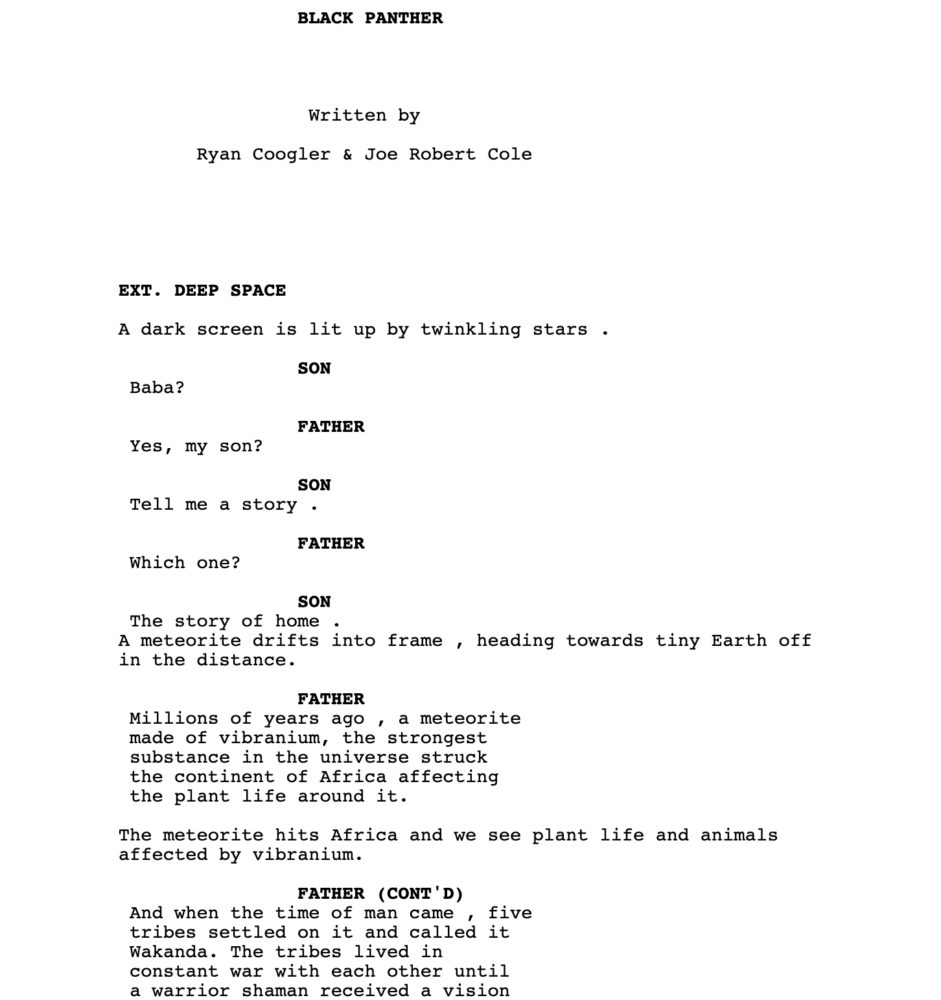
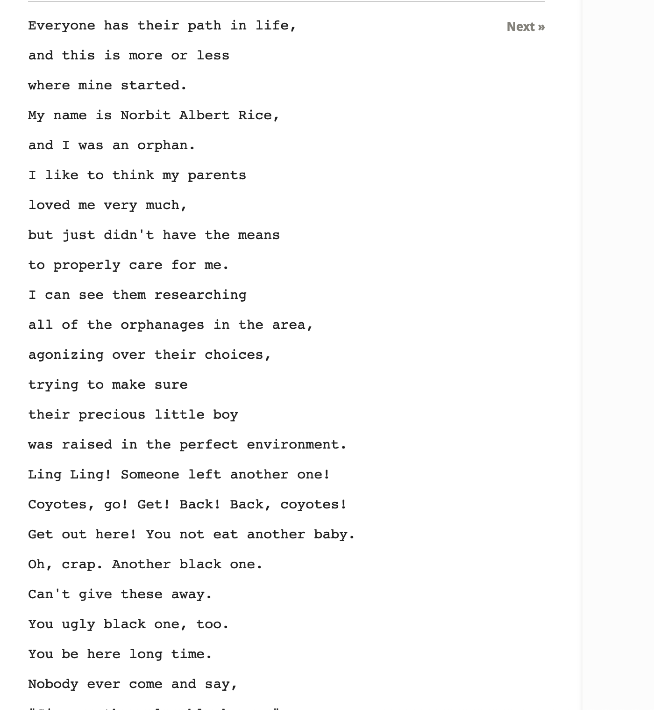
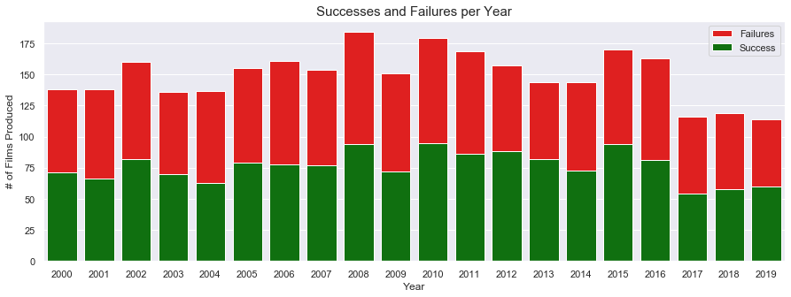
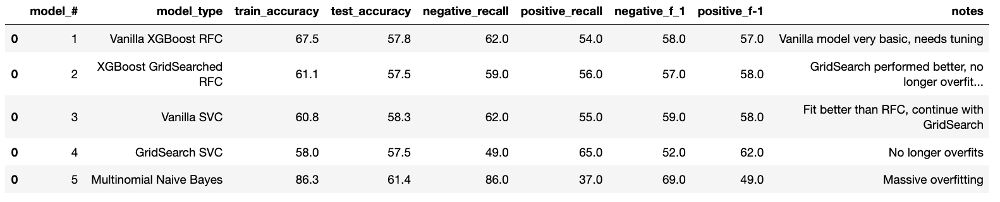

# Film Script Success Prediction Using NLP
## Flatiron Capstone Project

### Objective

The objective of this project was to use text data from movie scripts produced over the last 20 years to build a machine learning model to predict the success of future unproduced film scripts. This project has application for the film industry in that it can save the film industry hundreds of millions of dollars per year in wasted salary for script readers, wasted revenue for unproduced would-be-successful scripts, and avoided losses for producing film failures. 

### Data & Methodology

The data for the project was web-scraped using API Calls, Selenium, BeautifulSoup, PDFMiner from a variety of sources. 

- Film titles, production budgets, and box office gross information was web-scraped from TheNumbers.com using BeautifulSoup
- Genre, runtime, release date, and behind-the-camera talent information was obtained by making API calls to OMDBapi.com
- Scripts were webscraped using Selenium and BeautifulSoup from IMSDB.com, Scripts.com, and SubsLikeScript.com and cleaned using the TextHero library

For this project, I followed the ROSE-MED methodology to guide my data science workflow. 

### Cleaning & EDA

The biggest challenge I faced with this project was finding complete scripts online that I would be able to webscrape using Selenium or BeautifulSoup or extract from a PDF file using PDFMiner. By and large, successful movies with noteworthy scripts were available in full script form on IMSDB.com. However, scripts from less notable films were difficult to find as they are not the widely distributed collectibles. I had to settle for dialogue transcripts from sites like Scripts.com and SubsLikeAScript.com. The difference between the two types of scripts are shown below. 

#### Full Script from IMSDB.com

#### Dialogue Transcript from Scripts.com

I used the TextHero library and Regex to clean and extract only the dialogue from the full scripts so that it matched the dialogue transcripts that I had for a majority of the scripts. TextHero was used to remove stop words, punctuation, whitespace, and tokenize script contents. This information was then used to build out additional features (total word count, words per minute, and vocabulary diversity). 

#### Succesful Film Script Word Cloud

#### Failed Film Script Word Cloud

#### Success v Failures By Year

### Modeling & Model Results
For this project, I instatiated and fit a XGBoosted Random Forest Classifier and a Support Vector Machine using a linear kernel. After using GridSearchCV to select the best hyperparameter values, I was only able to achieve 61% accuracy on the best performing model, the XGBoosted Random Forest Classifier. I believe that I was unable to train a predictive models because I did not have enough data to do so. Model results and visualizations are below. 

#### Model Results DataFrame

### Model Results Visualizations

### Conclusion & Future Work
In conclusion, since I was unable to web scrape enough data for this project I was unable train a predictive model. However, I believe that given the model that I was able to train performed at a higher rate than a coin flip (50%) there is a correlation to the script contents and a film's overall success. In the future, I would like the time to collect more script data and retrain a model with double the amount of data.
