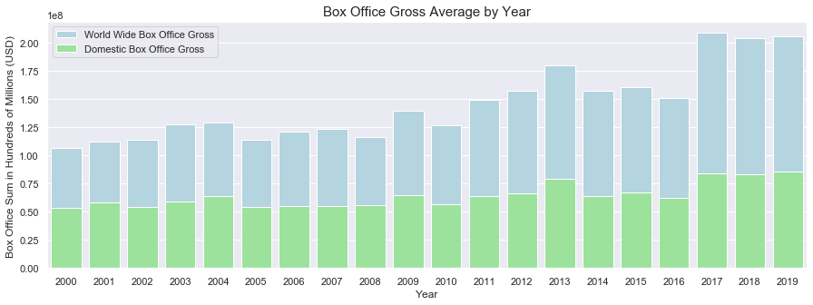
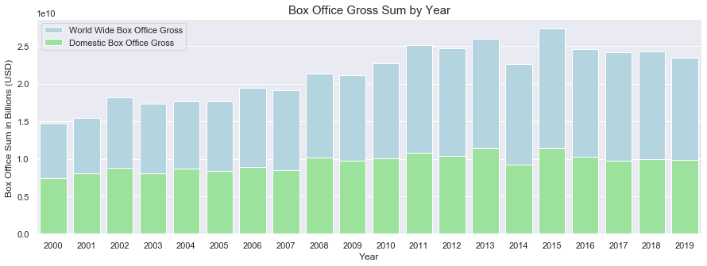
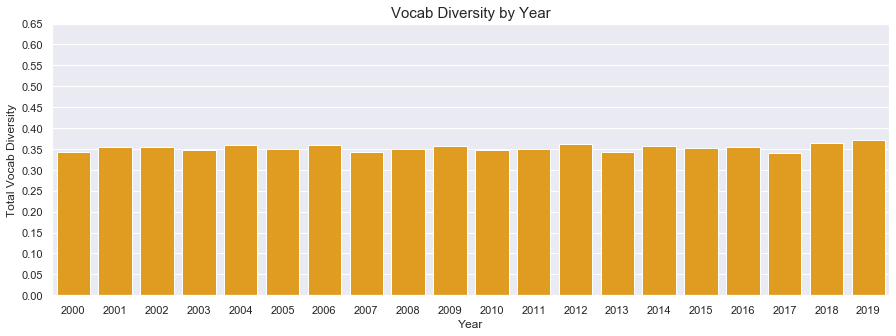
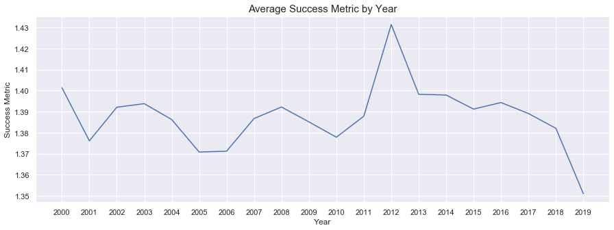
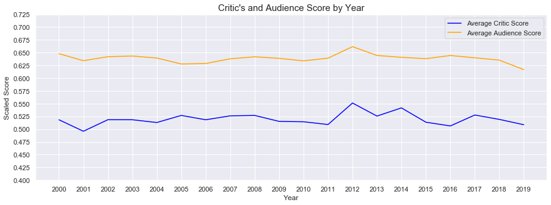
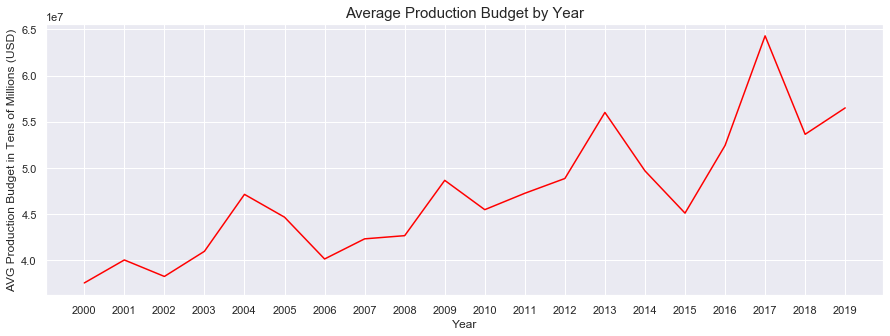

# Film Script Success Prediction Using NLP
## Flatiron Capstone Project

### Objective

The objective of this project was to use text data from movie scripts produced over the last 20 years to build a machine learning model to predict the success of future unproduced film scripts. This project has application for the film industry in that it can save the film industry hundreds of millions of dollars per year in wasted salary for script readers, wasted revenue for unproduced would-be-successful scripts, and avoided losses for producing film failures. 

### Data & Methodology

The data for the project was web-scraped using API Calls, Selenium, BeautifulSoup, PDFMiner from a variety of sources. 

- Film titles, production budgets, and box office gross information was web-scraped from TheNumbers.com using BeautifulSoup
- Genre, runtime, release date, and behind-the-camera talent information was obtained by making API calls to OMDBapi.com
- Scripts were webscraped using Selenium and BeautifulSoup from IMSDB.com, Scripts.com, and SubsLikeScript.com and cleaned using the TextHero library

For this project, I followed the ROSE-MED methodology to guide my data science workflow. 

### Cleaning & EDA

The biggest challenge I faced with this project was finding complete scripts online that I would be able to webscrape using Selenium or BeautifulSoup or extract from a PDF file using PDFMiner. By and large, successful movies with noteworthy scripts were available in full script form on IMSDB.com. However, scripts from less notable films were difficult to find as they are not the widely distributed collectibles. I had to settle for dialogue transcripts from sites like Scripts.com and SubsLikeAScript.com. The difference between the two types of scripts are shown below. 

#### Full Script from IMSDB.com

#### Dialogue Transcript from Scripts.com

I used the TextHero library and Regex to clean and extract only the dialogue from the full scripts so that it matched the dialogue transcripts that I had for a majority of the scripts. TextHero was used to remove stop words, punctuation, whitespace, and tokenize script contents. This information was then used to build out additional features (total word count, words per minute, and vocabulary diversity). 

#### Succesful Film Script Word Cloud

#### Failed Film Script Word Cloud

### Modeling & Model Results
For this project, I instatiated and fit a XGBoosted Random Forest Classifier and a Support Vector Machine using a linear kernel. After using GridSearchCV to select the best hyperparameter values, I was only able to achieve 61% accuracy on the best performing model, the XGBoosted Random Forest Classifier. I believe that I was unable to train a predictive models because I did not have enough data to do so. Model results and visualizations are below. 

#### Model Results DataFrame

### Model Results Visualizations

### EDA Findings 

#### Success v Failures By Year
While exploring the data I found an interesting trend that I chose to explore further using EDA. While visualizing the total output of success vs. failures in films year over year, there was a contraction in total releases from the years 2017 - 2019. 

#### Box Office Average by Year

Following up on this trend, I chose to plot the average box office gross of all films year over year. The same three years distinguished themselves as they did in the last visualization, this time the average gross grew and remained largely the same over these three years. 

#### Box Office Sum by Year

However, when I plotted the sum total of the each year's releases the sum total was less than the box office's peak in 2015. So with the information we have so far we can say that less movies are being released and while they are making more money on average, the total amount of money being taken in is less than the box office peak in 2015. 

#### Vocabulary Diversity by Year (Average)

When exploring the Vocabulary Diversity metric that was feature engineered for this project, by and large the diversity of the vocabulary did not adjust all that much year over year

#### Success Metric by Year (Average)

When plotting the success metric feature, there was an overall downturn in the overall success (box office, critic/audience reviews) over the same period of time. 

#### Audience and Critic Score By Year

A similar downturn is evident when plotting the average audience (imdb User) score and average critic (Metacritic) score. 

#### Average Production Budget by Year

When plotting the production budget average year over year, movies are clearly getting more expensive on average. 

### EDA Conclusions
From the visualizations above it is clear that less more expensive films are being made on average and since we do not see a marked difference in their content script-wise, perhaps this is why they are overall less successful. Perhaps films have become more similar in their content and structure, and that audience's and critics alike are becoming tired with the formula that proved so successful just a few year's earlier. Perhaps that is why the models I trained for this project turned out to be so unpredictable in their output: the contents of the scripts are so similar that an outside variable (audience expectations can not be mapped to a model) is closer to the root cause of a film's success.  

### Modeling Conclusions & Future Work
In conclusion, since I was unable to web scrape enough data for this project I was unable train a predictive model. However, I believe that given the model that I was able to train performed at a higher rate than a coin flip (50%) there is a correlation to the script contents and a film's overall success. In the future, I would like the time to collect more script data and retrain a model with double the amount of data.
